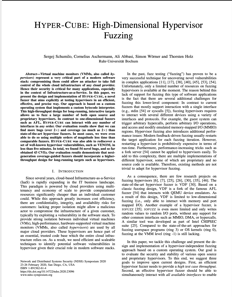

# HYPER-CUBE: High-Dimensional Hypervisor Fuzzing

<a href="https://www.ndss-symposium.org/wp-content/uploads/2020/02/23096-paper.pdf">  </a>

Hyper-Cube is a black-box fuzzer designed specifically to test x86 hypervisors. Our approach is based on a custom operating system that implements a custom bytecode interpreter to enable fuzzing of emulated hypervisor components. The OS is tailored to work with most x86 hypervisors that support either BIOS or 32-bit UEFI boot. Further, it implements basic features such as ACPI and PCI device enumeration to automatically detect potential MMIO (memory-mapped I/O) and PIO (port I/O) areas for later fuzzing. As a result, Hyper-Cube has helped to uncover crashes and vulnerabilities in different hypervisors such as QEMU, bhyve, Virtual Box, VMWare, ACRN, and Parallels.

Please note that this version of Hyper-Cube is only designed for black-box fuzzing. Support for feedback fuzzing has later been added in our follow-up paper Nyx. In that [paper](https://www.usenix.org/system/files/sec21summer_schumilo.pdf), we covered how we implemented feedback fuzzing support for type-2 hypervisors by employing different techniques, such as fast VM snapshots and Intel PT support. Like Hyper-Cube, the fuzzing is also performed by a custom OS, which is based on a slightly modified version of Hyper-Cube. The source code of this modified version can be found [here](https://github.com/RUB-SysSec/Nyx/tree/main/nyx_fuzzer/hypervisor_spec/build/hypertrash_os). However, unlike Nyx, Hyper-Cube can be used with most hypervisors without much hassle, simply by booting it in the target hypervisor.

```
@inproceedings{hypercube,
  title={HYPER-CUBE: High-Dimensional Hypervisor Fuzzing.},
  author={Schumilo, Sergej and Aschermann, Cornelius and Abbasi, Ali and W{\"o}rner, Simon and Holz, Thorsten},
  booktitle={NDSS},
  year={2020}
  url = {https://www.ndss-symposium.org/ndss-paper/hyper-cube-high-dimensional-hypervisor-fuzzing/},
}
```

## Setup:

Run the provided `setup.sh` script to install all required dependencies. This script will take care of all dependencies, prepare and compile GRUB, and set up everything else required. Please note that this script is specifically designed to work with Ubuntu 16.04 or 18.04 (similar to Hyper-Cube, which has only been tested with these two Ubuntu versions).

```bash
cd hypercube/
./setup.sh
```

## Getting Started: 


In the following section, we will outline how to use the fuzzing capabilities of Hyper-Cube. It is important to note that certain features, such as input minimization, currently only work with QEMU (more on that later). 

In general, the structure of this project can be divided into two main components: first, there is the main component of the project, which consistes of the actual operating system and the fuzzer (both are mainly written in C). The code can be found [here](os/). The second part consists of additional tooling written in Python, which can be accessed [here](scripts/). The Python tool serves the purpose of automating specific tasks, such as building the OS image, and in addition, it also implements high-level features, such as the input minimizer.

Please note that some features currently only work with QEMU. This limitation arises from the necessity of a target-specific runner module, which must be implemented in Python. The purpose of a target runner is to launch the target hypervisor and provide information in the event of crashes. Additionally, it also implements features such as timeout detection and so on. The QEMU target runner implements all of that using ptrace. The code of the QEMU runner can be found [here](scripts/executor/qemu.py). Besides, a custom target runner is not required to run the fuzzer. 

### General Usage: 

Hyper-Cube can be easily configured to target a single or even multiple different PIO and MMIO areas at the same time. For this purpose, we utilize the Python tooling to generate a custom build of Hyper-Cube OS specifically tailored for our following use case.

While it is also possible to perform the build procedure manually by compiling and packaging the code located in the `./os/` directory by yourself; however, we strongly recommend utilizing the Python tool instead. Manually configuring Hyper-Cube OS also requires a C-header file that acts as a configuration and is typically automatically generated by the Python tooling.

In the following example, we will generate an OS image that targets the VGA device emulator. For this purpose, we configure Hyper-Cube to automatically initiate PCI device enumeration, detecting all available PCI devices once the boot process is complete. Additionally, we apply a filter set to VGA to limit the fuzzer to interact only with PCI devices related to the emulated graphics card.

```bash
python3 hypercube.py generate /tmp/vga.iso --enable_pci --filter "VGA"
```

This OS image can now be used with any hypervisor or emulator that supports x86 BIOS boot. Once the OS image is booted, you will see various visual VGA artifacts, due to the fuzzer performing random operations on the associated PIO and MMIO regions. In case a bug or vulnerability exists in the emulator implementation, this can also lead to a crash (such as CVE-2018-3223). If the target hypervisor supports EFI boot for 32-bit operating systems, you can generate an EFI-compatible image by enabling the `--uefi` option. Please note that 64-bit EFI boot is not supported.

Moreover, you can also enable the enumeration of other device types, such as legacy I/O or x86 platform-specific devices like HPET or APIC. The enumeration of these device types can be enabled by setting the corresponding options via command line arguments. To get a comprehensive list of all available options, run the following command:

```bash
python3 hypercube.py generate --help
```

This command will result in the following output:

```
...
  --enable_io           enable IO enumeration
  --enable_default_io   enable default IO enumeration
  --enable_pci          enable PCI enumeration
  --enable_e_pci        enable extended PCI
  --enable_apic         enable APIC
  --enable_hpet         enable HPET
...
```

Additionally, if needed, one can manually configure target areas as follows: 

```
  --extra_areas <base> <length> <type> <name>
    # base:   physical address of the target area (hexadecimal)
    # lenght: size of the target area (hexadecimal)
    # type:   0=PIO / 1=MMIO
    # name:   name of this specific area
```

Moreover, to output a comprehensive list of all detected and configured PIO and MMIO areas, it is recommended to create an image without enabling the actual fuzzer. This is especially useful for VGA or serial device fuzzing, as it allows to manually check the configuration once the OS is booted. This can be done by setting the `--disable_fuzzer` flag. Upon booting the OS, the information on detected and configured areas will be reported through either the serial interface or VGA (if the `--enable_vga` option is enabled).

Furthermore, after the OS has been booted, it will print the seed value of the RNG used by the fuzzer. This seed value can later be used to reproduce specific crashes. For instance, you can generate a new OS image with a fixed seed value by setting the `--seed <value>` argument. This seed value is also used to run the input minimization, aiming to find a minimal crash reproducer.

## Target QEMU's `megasas` Emulator:

In the following section, we will describe various use cases by targeting QEMU's implementation of the `megasas` RAID emulator. Additionally, we will demonstrate how to use the test case minimizer with the bugs found.

### Run the Fuzzer: 

We start with fuzzing the megasas device emulator in QEMU 4.0.0. To do this, we first need to compile an ASAN build of QEMU 4.0.0 as our target hypervisor for this example. Please note that compiling QEMU 4.0.0 is not supported on Ubuntu 16.04.

```bash
cd targets/
./compile_qemu.sh 4.0.0 asan
cd -
```

Next, we generate a new OS image with enabled PCI device enumeration and a set filter for PCI class names containing "RAID": 

```bash
python3 hypercube.py generate /tmp/megasas.iso --enable_pci --filter "RAID"
```

Now we boot the OS and launch the fuzzer with the following command.

```bash
python3 hypercube.py run qemu-4.0.0-asan /tmp/megasas.iso --qemu_params " -device megasas"
```

This command will work only with QEMU on Linux because it requires a target runner, that is currently only implemented for QEMU. As an alternative, you can manually launch QEMU with Hyper-Cube OS by using the following command:

```bash
targets/qemu-4.0.0-asan/x86_64-softmmu/qemu-system-x86_64 -cdrom /tmp/megasas.iso -serial mon:stdio -m 100 -nographic -net none  -device megasas
```

### Input Minimization & Testcase Decompiler:

After some time, with the command above, the fuzzer will trigger a crash in QEMU. A crash can be reproduced by using the same seed value of a given run (in our example, we pick 0x680aaa46, which results in a heap use-after-free). 
We can generate a new image with a fixed seed value, using the following command:

```bash
python3 hypercube.py generate /tmp/test.iso --enable_pci --filter "RAID" --seed 0x680aaa46
```

Moreover, the input minimizer can also be utilized to produce a minimal test case reproducer for this specific crash. Similar to the previous command, the test case reproducer also expects an RNG seed.

Hyper-Cube OS uses a bytecode interpreter called Tesseract to convert a stream of random data into a sequence of fuzzing OP codes (more details on that are described in our paper). This stream is basically the output of a RNG seeded by either a random or fixed value. Instead of a data stream, the input minimizer will try to find a fragment from that stream reproducing the same crash. 
So, instead of using a fixed seed to reproduce a crash, a test case file can also be embedded in the OS image to get the same result.   

For this purpose, the minimizer will transform the seed value into multiple files, each containing data chunks taken from the input stream generated from the given seed. In theory, up to 128 MB of test case data can be embedded into a single image, but this size will significantly slow down the boot process and, thus, affect the overall fuzzing performance. For this reason, the input minimizer strives to find a reproducer that does not exceed 16 MB in size. 

Once a valid test case file has been found, the input minimizer proceeds by selectively removing random opcodes from the file. After each change to the test case, a new image is generated and verified by executing the target to ensure that the crash persists.

Next, we will demonstrate how to run the test case minimizer. Additionally, in scenarios where certain device emulators or targets contain multiple bugs, it is recommended to explicitly specify the expected error message using an "error filter". In our example, we specify that the test case should trigger the very same `heap-use-after-free` error. Depending on the target, this process usually takes a few minutes to complete.

```bash
python3 hypercube.py minimize qemu-4.0.0-asan /tmp/mini.iso /tmp/mini.payload \
  --enable_pci \
  --filter "RAID" \
  --seed 0x680aaa46 \
  --e_filter "heap-use-after-free" \
  --qemu_params " -device megasas"
```

As a result, the input minimization process will output two files: the minimized input file (`/tmp/mini.payload`) and a bootable image that includes this file and reproduces the crash (`/tmp/mini.iso`). To debug the cause of the crash in the target hypervisor, the decompiler module can be utilized to decode the input file into a human-readable list of opcodes. Once the input minimizer has finished, simply run the following command to decompile a test case file:

```bash
python3 hypercube.py decompiler qemu-4.0.0-asan /tmp/mini.payload --enable_pci --filter "RAID" --qemu_params " -device megasas"
```

Furthermore, the resulting test case reproducer file can also be be embedded into a new image. This basically works the same way as using a fixed seed to reproduce the crash. With the following command we create a new image that will contain our test case reproducer file: 

```bash
python3 hypercube.py generate /tmp/test.iso --enable_pci --filter "RAID"  --input /tmp/mini.payload 
```

## Real World Examples: 

In this  section, we show how to use Hyper-Cube to discover and trigger crashes in more recent versions of hypervisors such as QEMU 7.2.1 and bhyve (FreeBSD 13.1). The following steps can also be applied similarly to other hypervisors and emulators.

### QEMU IDE: Div-by-Zero: 

With the following command, we first create an OS image that will target all PIO and MMIO areas associated with the IDE device emulator in QEMU: 

```bash
python3 hypercube.py generate /tmp/ide.iso --enable_pci --enable_default_io --filter "IDE"
```

Next, we compile an ASAN build of QEMU 7.2.1 as follows (this requires Ubuntu 18-04): 

```bash
cd targets/
./compile_qemu.sh 7.2.1 asan
cd ..
```

Finally, we proceed to run the fuzzer and launch QEMU with a configuration that emulates an old IDE device with a virtual HDD of 1KB in size. We use the option `--extra_file_path` and `--empty_extra_file_size` to automatically create a sparse file for each execution.  

```bash
python3 hypercube.py run qemu-7.2.1-asan /tmp/ide.iso --qemu_params " -hda /tmp/drive.img" --extra_file_path "/tmp/drive.img" --empty_extra_file_size 1
```

With this image we should see different bugs triggered, including a crash caused by a division by zero bug.

### bhyve XHCI: Segmentation Fault (Null Pointer Dereference):  

In the next example, we first create an image that will target the XHCI USB 3.0 emulator in bhyve. Since XHCI is a PCI device, we simply enable PCI device enumeration and apply a filter for "USB" device types.

```bash
python3 hypercube.py generate /tmp/bhyve.iso --enable_pci --filter "USB"
```

Next, we need to transfer the generated image to our FreeBSD virtual or physical machine. This can be done using methods such as SSH for instance. Once the image is copied, execute the following command to launch bhyve with an XHCI device (assuming FreeBSD 13.1-RELEASE) to trigger a null pointer dereference:

```bash
kldload vmm
bhyvectl --vm=testvm --destroy 
bhyve -w -H -s 0:0,hostbridge -s 1:0,lpc -s 2:0,ahci-cd,/tmp/bhyve.iso -l com1,stdio -s 29,fbuf,tcp=0.0.0.0:5900,w=800,h=600 -s30,xhci,tablet -s 8:0,nvme,ram=1 -c 1 -m 1024M -l bootrom,/usr/local/share/uefi-firmware/BHYVE_UEFI_CSM.fd testvm
```

## Perform Code Coverage Experiments: 

In our paper, we utilized GCOV for conducting our code coverage experiments. To simplify this process, we can use the Python tooling that automates essential steps such as removing previous coverage data, running the target, and invoking GCOV afterwards. However, it is important to note that this feature, along with the input minimization and input decompiler, requires a target runner specifically implemented for a particular hypervisor.

Moreover, for our use case, specific modifications are necessary in QEMU to address certain limitations of GCOV. For example, the GCOV runtime will not flush coverage data to the actual GCOV files before either `__gcov_flush()` or `exit()` is called, which is not ideal for fuzzing scenarios where the target may crash.

Consequently, we have made several modifications to a few QEMU versions to address these limitations. This includes adding extra signal handlers to flush coverage data when a crash occurs. Also, we use an LD_PRELOAD [shared object](misc/gcov_hooks.c) file that is loaded and executed just before the main function of the target is entered, allowing us to install additional signal handlers to flush GCOV data before the target terminates.

Furthermore, it's worth noting that enabling both GCOV and ASAN is not supported by our tooling. Therefore, there is a possibility of missing certain bugs that can otherwise easily be detected with an ASAN build. Also, using GCOV significantly impacts the overall performance of the target hypervisor and thus also affect the fuzzing performance.

To compile QEMU 4.0.0 with GCOV support enabled, simply execute the following command:

```bash
cd targets/
./compile_qemu.sh 4.0.0 gcov
cd -
```

Next, we run a coverage experiment targeting the SDHCI device emulator and measure the code coverage.

```bash
python3 hypercube.py coverage SDHCI qemu-4.0.0-gcov
```

The target runner will now display the currently archived code coverage after either a timeout has occurred or the target was restarted due to a crash. 

## Rediscover Known Vulnerabilites in QEMU:

Finally, we demonstrate how to rediscover known vulnerabilities as described in our paper. These experiments have been performed and tested on Ubuntu 16-04.

### Trigger CVE-2015-3456 (VENOM): 

First, we need to compile an older version of QEMU with Address Sanitizer enabled:

```bash
cd targets/
sh compile_qemu.sh 2.0.0 asan
cd - 
```

VENOM is a QEMU vulnerability that existed in previous implementations of QEMU's device emulator for the floppy drive controller (FDC). To target and fuzz the FDC, we generate an OS image with the `--enable_default_io` option enabled. This option contains a list of default PIO ranges commonly found on most x86 machines. We also apply a filter to "Floppy":

```bash
python3 hypercube.py generate /tmp/venom.iso --enable_default_io --filter "Floppy"
```

With these settings, we can now trigger the bug using the following command:

```bash
python3 hypercube.py run qemu-2.0.0-asan /tmp/venom.iso
```

Depending on your machine, it should take just a few seconds for the bug to be triggered.

### Trigger CVE-2015-8743 (NE2000): 

Another known vulnerability covered in our paper is CVE-2015-8743, which is an out-of-bounds read/write access in the NE2000 NIC emulator.

We build the same version of QEMU as for the VENOM experiment:

```bash
cd targets/
./compile_qemu.sh 2.0.0 asan
cd -
```

Afterward, we create an image that performs a search for corresponding PIO and MMIO areas by performing a PCI device enumeration with a filter set to "Ethernet":

```bash
python3 hypercube.py generate /tmp/2015-8743.iso --enable_pci --filter "Ethernet" --set_io_bruteforce_range 16
```

To trigger the bug, execute QEMU with the following arguments:

```bash
python3 hypercube.py run qemu-2.0.0-asan /tmp/2015-8743.iso --qemu_params " -device ne2k_pci" --timeout 30
```

Alternatively, you can also trigger this vulnerability by manually starting QEMU with the following arguments:

```bash
./targets/qemu-2.0.0-asan/x86_64-softmmu/qemu-system-x86_64 -cdrom /tmp/2015-8743.iso -serial mon:stdio -m 100 -nographic -net none  -device ne2k_pci
```

### License

Hyper-Cube is provided under **GPLv2 license**. 

**Free Software Hell Yeah!** 